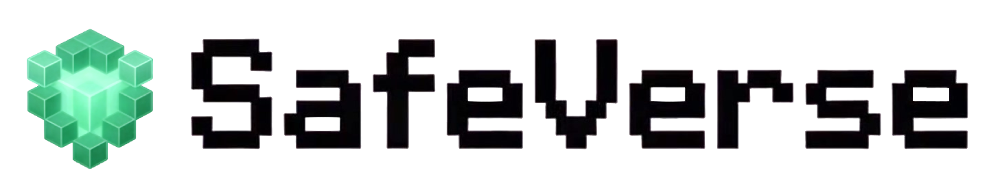

<div align="center" style="margin-bottom: 0px;">
  
</div>

**SafeVerse** is the world's first open-source platform for trustworthy embodied AI. It transforms the indoor videos into interactive, physics-compliant 3D scenes within minutes, enables automated attack-defense exercises, and supports the shift from static benchmarking to dynamic adversarial evolution—delivering a **low-cost**, **high-generalization** generative evolution arena for embodied agents.

## ✨ Features
- 🎮 **Real-to-Sim Digital Twin**: Replicate real-world structures and semantics in simulation.
- ⚡️ **Build in Minutes, Interact with Everything**: Build interactive 3D scenes from video in minutes with part-level manipulation. 
- 🛡️ **Closed-Loop Evolution**: Support different adversarial scenarios and online RL training, enabling agents to co-evolve in safety and capability.


## 📥 Getting Started
```bash
git clone --recursive https://github.com/AI45Lab/SafeVerse.git
cd SafeVerse
git lfs pull
```

For your convenience, we have split the project into independent modules. Please follow the documentation to run the corresponding part:
- [Real-to-Sim Reconstruction](doc/reconstruction.md)
- [Agent Training](doc/agent_training.md)

## 🤝 Acknowledgements
This project is based on the following awesome repositories:

- [Human3R](https://github.com/fanegg/Human3R)
- [SAM3D](https://github.com/facebookresearch/sam-3d-objects)
- [GPT-4o](https://github.com/marketplace/models/azure-openai/gpt-4o)

Thanks for the authors for their valuable works.